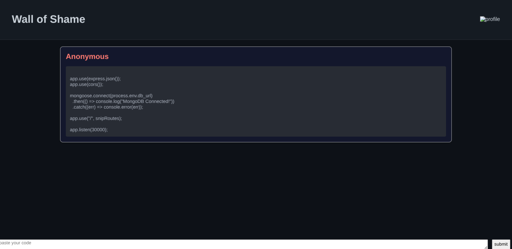
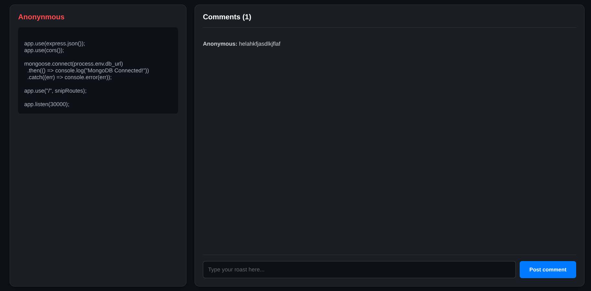
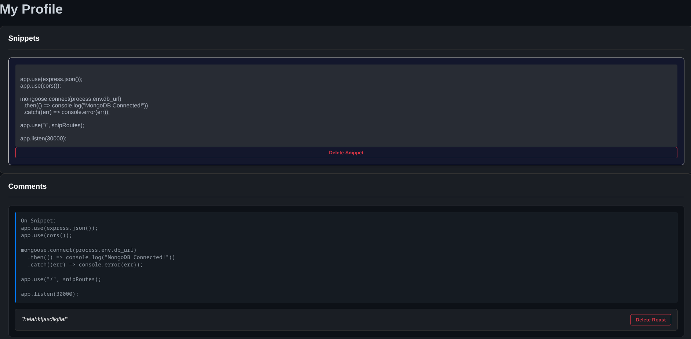

#  Wall of Shame

A single-page, anonymous "shame wall" where developers can post snippets of code they are embarrassed by or that went horribly wrong.

##  Features
- **Global Wall**: page where users can share their worst code snippets.
- **Anonymous comments**: Reply to snippets with comments without needing an account.
- **Identity & Ownership**: Uses a browser-based `shame_uuid` to allow users to delete only their own posts and comments.
- **Profile History**: A dedicated page to view and manage your history of posted snippets and roasts.

## Tech Stack
- **Frontend**: React.js
- **Backend**: Node.js, Express.js
- **Database**: MongoDB (Mongoose)
##Images

## Setup

###  Backend
1. `npm install`
2. Create a `.env` file with `db_url=YOUR_MONGODB_URI`
3. `node backend/index.js`

### 2. Frontend
1. `npm install`
2. `npm run dev`
